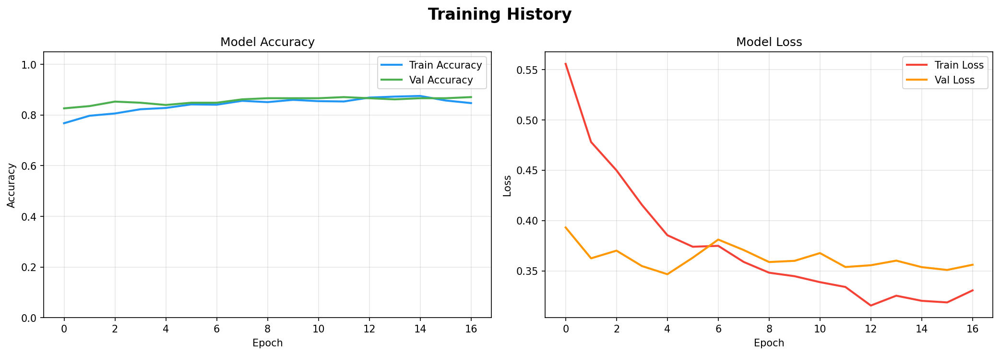

# 🛡️ Face Mask & Helmet Detection System

[](https://www.python.org/)
[](https://www.tensorflow.org/)
[](https://streamlit.io/)
[](https://opensource.org/licenses/MIT)

A complete end-to-end Deep Learning project for **Face Mask** and **Helmet Detection** using Transfer Learning with MobileNetV2. This repository includes everything from data preparation and model training to real-time webcam inference and a fully functional Streamlit Web App deployment.

---

## 📑 Table of Contents
- [Features](#-features)
- [Project Structure](#-project-structure)
- [Datasets](#-datasets)
- [Installation](#-installation)
- [Usage](#-usage)
  - [1. Training](#1-training)
  - [2. Evaluation](#2-evaluation)
  - [3. Real-Time Detection](#3-real-time-detection)
  - [4. Web Application](#4-web-application)
- [Deployment](#-deployment)
- [Expected Results](#-expected-results)
- [License](#-license)

---

## ✨ Features
- **Dual Classification Tasks:** Separate pipelines for Face Mask Detection (Mask / No Mask) and Helmet Detection (Helmet / No Helmet).
- **Transfer Learning:** Utilizes the highly efficient **MobileNetV2** architecture optimized for real-time edge devices.
- **Real-Time Inference:** Live detection through a webcam using OpenCV integration.
- **Interactive UI:** A beautiful and responsive web application built with Streamlit.
- **Scalable:** Modular code structure allowing easy extensions to new datasets.

---

## 📂 Project Structure

```text
mask-helmet-detector/
│
├── app/                      # Web deployment application
│   └── streamlit_app.py      # Streamlit UI script
├── dataset/                  # Datasets (Ignored in Git)
├── models/                   # Saved trained models (Ignored in Git)
├── notebooks/                # Jupyter Notebooks for EDA & prototyping
│   └── full_pipeline.ipynb
├── utils/                    # Utility scripts
│   ├── data_loader.py        # Dataset loading & augmentation
│   ├── model_builder.py      # MobileNetV2 model architecture
│   └── visualizer.py         # Plotting & visualization utilities
│
├── evaluate.py               # Model evaluation script
├── predict.py                # Single image prediction script
├── realtime_detect.py        # Live webcam detection script
├── requirements.txt          # Python dependencies
├── train.py                  # Main training script
├── .gitignore                # Ignored files & directories
├── LICENSE                   # MIT License
└── README.md                 # Project documentation
```

---

## 📊 Datasets
This project uses public datasets from Kaggle. Download them and place them in the `dataset/` directory according to the structure above.

- **Face Mask Dataset:** [Kaggle - Face Mask Detection](https://www.kaggle.com/datasets/andrewmvd/face-mask-detection)
- **Helmet Dataset:** [Kaggle - Helmet Detection](https://www.kaggle.com/datasets/andrewmvd/helmet-detection)

---

## 🛠 Installation

1. **Clone the repository:**
   ```bash
   git clone https://github.com/bilalahmed251/mask-helmet-detector.git
   cd mask-helmet-detector
   ```

2. **Create a virtual environment (Optional but recommended):**
   ```bash
   python -m venv venv
   source venv/bin/activate  # On Windows: venv\Scripts\activate
   ```

3. **Install the dependencies:**
   ```bash
   pip install -r requirements.txt
   ```

---

## 🚀 Usage

### 1. Training
To train the models from scratch on your dataset:
```bash
# Train mask detection model
python train.py --task mask --epochs 20 --batch_size 32

# Train helmet detection model
python train.py --task helmet --epochs 20 --batch_size 32
```

### 2. Evaluation
To evaluate a trained model on the validation set:
```bash
python evaluate.py --task mask
```

### 3. Real-Time Detection
To run live inference using your webcam:
```bash
python realtime_detect.py --task mask
```
*(Press `q` to quit the webcam window).*

### 4. Web Application
To launch the interactive Streamlit UI locally:
```bash
streamlit run streamlit_app.py
```

---

## 🌐 Deployment
This application is designed to be easily deployed on **Streamlit Community Cloud**.

1. Push this repository to your GitHub account.
2. Go to [Streamlit Community Cloud](https://share.streamlit.io/).
3. Create a **New App** and select your repository (`bilalahmed251/mask-helmet-detector`).
4. Set the Main file path to `streamlit_app.py`.
5. Click **Deploy!** 

---

## 📈 Actual Results (V1 Model)
- **Validation Accuracy:** The V1 Mask Detection model achieved an impressive **87.11%** accuracy on the validation dataset after just 17 epochs of training!
- **Real-Time Performance:** Runs at **20–30 FPS** on a standard CPU, ensuring smooth live detection.

### Training Curves


---

## 📄 License
This project is licensed under the MIT License. See the `LICENSE` file for more details.
